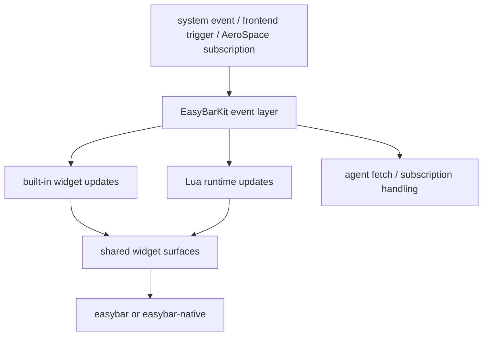

# Event Flow

EasyBarKit coordinates several kinds of events:

- macOS state changes;
- AeroSpace-related changes;
- agent socket updates;
- Lua runtime subscriptions;
- direct control-socket commands;
- user interaction such as clicks, hover, scroll, and sliders.

## Simplified flow

The important design choice is that EasyBarKit acts as the coordinator. Frontends do not create
parallel event systems for their presentation mode.

## Delivery backpressure

Automatic native subscriptions keep at most 256 must-deliver events. If a subscriber does not
consume them before another action arrives, EasyBarKit records the dropped event, finishes that
stalled stream, and removes the subscriber instead of silently losing an action while continuing
with corrupted state. Coalescing-only subscriptions keep only their newest state value.

Lua delivery separately retains at most 512 queued must-deliver payloads plus a bounded coalescing
queue. Reaching the action limit records `luaEventQueueOverflows`, suspends delivery for that runtime
session, and restarts Lua through normal supervision. The next runtime session explicitly resets the
sink. Current queue depth is exposed as `luaEventQueueDepth`.

## Lua runtime flow

The Lua runtime flow is:

1. EasyBarKit starts the Lua process.
2. Lua loads activated packages and manual widget files.
3. Lua declares which events it needs.
4. Swift starts only the necessary event sources.
5. Swift sends normalized events to Lua.
6. Lua updates widget state and emits rendered trees.
7. Swift decodes those trees and applies them to the shared widget store.
8. the active frontend hosts the resulting top-level widget surfaces.

This design keeps arbitrary Lua execution outside both frontend processes while preserving one
shared runtime model.
