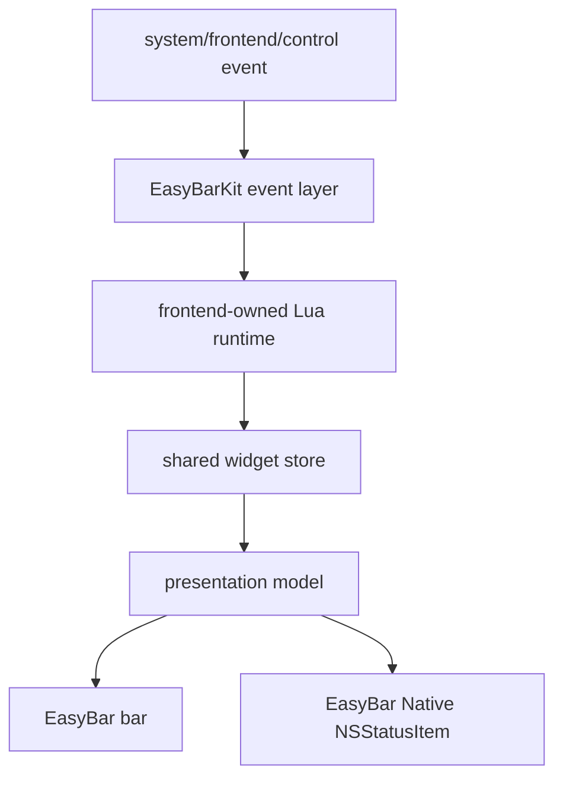
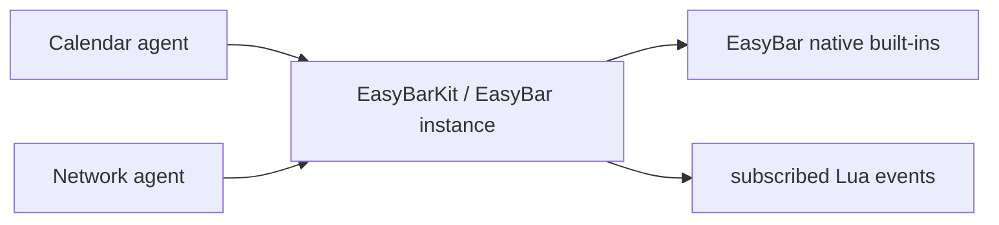

# Event Flow

EasyBarKit coordinates system events, Lua subscriptions, frontend input, control-socket commands, and
EasyBar-specific agent updates without creating a separate Lua event implementation per frontend.

## Shared Lua path

Each running frontend has its own instance of this runtime path and therefore its own Lua state.

## EasyBar agent path

EasyBar additionally consumes Calendar and Network agent data for its native built-ins and related
shared events:

EasyBar Native does not require this agent path merely because it uses the same EasyBarKit codebase.

## Backpressure

Native and Lua delivery remain bounded. Must-deliver native subscriptions use a finite queue; Lua
has bounded action and coalescing queues. An unhealthy Lua session is restarted instead of allowing
unbounded host memory growth or silently continuing after ordered actions are lost.
