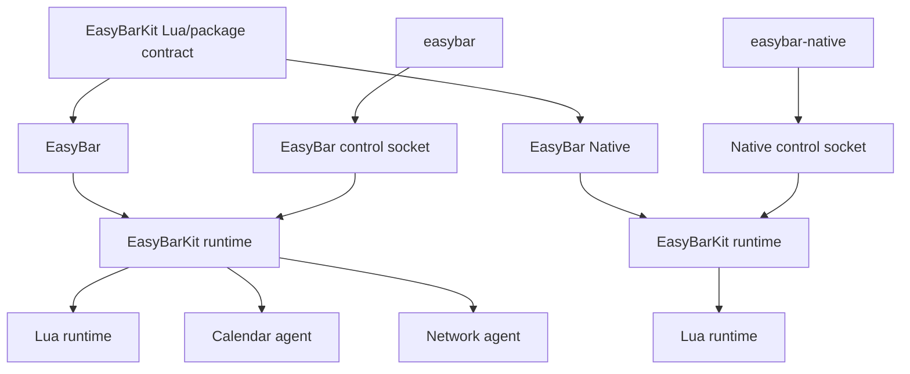

# Architecture Overview

EasyBar is a family of repositories built around one shared implementation layer and two independent
presentation frontends.

```text
easybar-kit      shared Swift/Lua implementation, CLI core, package manager, helper products
easybar          full-width custom-bar frontend + EasyBar packaging
easybar-native   isolated NSStatusItem frontend + easybar-native launcher
widgets          independently versioned Lua packages
registry         published package metadata and immutable release checksums
docs             easybar.dev source and generated-reference assembly
```

Both frontends depend on `easybar-kit`. They do not depend on each other and do not share mutable
user state by default.

## High-level runtime



## Shared implementation, separate ownership

EasyBarKit owns runtime behavior such as config parsing, Lua supervision, node rendering, package
management, IPC, and Inbox. A frontend identity supplies presentation policy and bootstrap defaults.

EasyBar owns the full built-in surface set and helper-agent integration. EasyBar Native owns only the
Inbox built-in plus Lua status-item presentation and does not require the helper agents.

The two frontends have separate config, widget, package, runtime, logging, and CLI namespaces. This
prevents one frontend's package update or reload from silently changing the other.

## Design goals

- frontend repositories decide **where** shared surfaces are presented;
- EasyBarKit decides **what** the shared runtime and Lua contract do;
- Lua is the portable public widget extension model;
- EasyBar-specific native built-ins and agents remain capabilities of the full EasyBar product;
- package manifests target EasyBarKit compatibility, while installation state belongs to a frontend;
- process protocols and reusable services stay typed and explicit.

## Related pages

- [Targets](targets.md)
- [Process Model](process-model.md)
- [Shared Layer](shared-layer.md)
- [CLI Core](cli-core.md)
- [Control Socket](control-socket.md)
- [Event Flow](event-flow.md)
- [Boundaries](boundaries.md)

