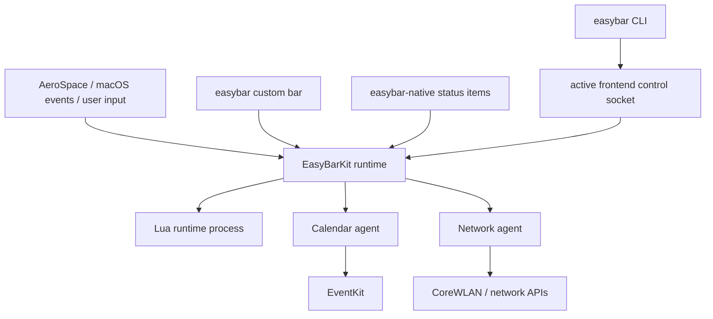

# Architecture Overview

EasyBar is a small family of repositories with one shared runtime and two presentation frontends.

```text
easybar-kit      shared Swift/Lua runtime, widgets, CLI, agents, config, package manager
easybar          customizable full-width top-bar frontend
easybar-native   native NSStatusItem frontend
widgets          independently versioned Lua packages
registry         published package metadata and immutable release checksums
docs             easybar.dev source and generated references
```

Both frontends depend on `easybar-kit`. They do not depend on each other.

## High-level runtime



Each frontend creates an `EasyBarApplicationIdentity` and supplies an `EasyBarSurfaceController`.
EasyBarKit owns runtime behavior below that surface boundary.

## Frontend responsibilities

The `easybar` repository owns only the custom full-width presentation:

- `BarPanel`
- top-edge window placement
- left/center/right bar layout
- custom-bar background, height, padding, and border presentation

The `easybar-native` repository owns only native status-area presentation:

- one `NSStatusItem` per top-level widget surface
- deterministic relative status-item ordering
- status-item lifecycle and sizing

The two frontends use the same `EasyBarPresentationModel` and widget views.

## EasyBarKit responsibilities

EasyBarKit owns shared behavior used by either frontend:

- config parsing and schema generation
- built-in widget state and SwiftUI rendering
- Lua widget loading, runtime supervision, events, and transport
- popups, context menus, themes, inbox, and widget state
- package installation, dependency resolution, and registry clients
- the `easybar` CLI
- calendar and network helper agents
- shared IPC, logging, and path contracts

The `[bar]` configuration section is part of the shared schema because the config parser lives in
EasyBarKit. Its geometry and custom-bar styling are consumed by `easybar`; `easybar-native` does not
turn those values into system menu-bar geometry.

## Design goals

The architecture keeps these boundaries explicit:

- frontend repositories decide **where** a widget surface is presented;
- EasyBarKit decides **what** the shared widget/runtime model does;
- agents own permission-sensitive collection and mutations;
- package manifests target the EasyBarKit runtime contract, not one frontend;
- Lua packages are presentation-portable unless they intentionally depend on a capability unavailable
  on a particular surface.

## Related pages

- [Targets](targets.md)
- [Process Model](process-model.md)
- [Shared Layer](shared-layer.md)
- [CLI](cli.md)
- [Control Socket](control-socket.md)
- [Event Flow](event-flow.md)
- [Boundaries](boundaries.md)
