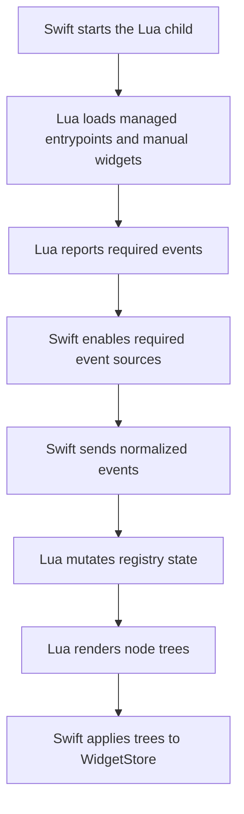

# Lua Runtime Overview

This section documents how EasyBarKit runs Lua widgets for either frontend. It is for contributors changing the
runtime implementation, not for normal widget authoring. Use [Lua Widgets](../../lua/index.md) for
the public API and guides.

## Process boundary

EasyBarKit does not embed Lua in either frontend process. It starts a separate Lua child and communicates
with it over a dedicated Unix socket. stderr remains reserved for structured runtime logs.

The separation provides:

- crash isolation;
- deterministic full resets on runtime restart;
- explicit JSON transport between Swift and Lua;
- independent process supervision and backpressure;
- a clear trust boundary around widget execution.

Widget code is still trusted local code. A separate process is isolation, not a security sandbox.

## High-level flow

Managed package entrypoints and manual widget files have different discovery rules. See
[Widget Loading](widget-loading.md). The package manager owns version selection and activation; see
[Package Store Internals](../package-store.md).

## Swift responsibilities

The main Swift pieces are:

- `LuaProcessController.swift` starts and stops the child process group;
- `LuaTransport.swift` owns the Lua socket and stderr handling;
- `EasyBarLuaRuntime` connects the configured socket and execs Lua;
- `LuaRuntime.swift` is the runtime facade;
- `WidgetEngine.swift` owns handshake, subscriptions, tree updates, and request routing;
- `LuaCommandService.swift` and `LuaCommandRunner.swift` own bounded external commands;
- `LuaTimerService.swift` owns cancellable one-shot timers;
- `EventHub.swift` forwards normalized events;
- `EventManager.swift` enables native sources from merged subscription demand;
- `RuntimeCoordinator.swift` owns startup, shutdown, reload, and runtime orchestration;
- `WidgetStore.swift` owns the latest decoded node trees.

Swift owns process lifecycle, command limits, timers, transport health, and native event sources. Lua
owns widget state and rendering decisions.

## Lua responsibilities

The main Lua pieces are:

- `runtime.lua` bootstraps the runtime and owns the transport read loop;
- `loader.lua` creates per-entrypoint environments and executes widget code transactionally;
- `api.lua` exposes the public `easybar` API and discovery helpers;
- `registry.lua` stores node state;
- `subscriptions.lua` stores event and interval handlers;
- `events.lua` normalizes and dispatches incoming events;
- `render.lua` derives flat output trees from registry state;
- `json.lua` encodes and decodes protocol payloads;
- `log.lua` writes structured records to stderr.

## Registry and rendering model

Widgets mutate registry state through node handles. The renderer derives output from that state; it
does not send incremental UI mutation commands to Swift.

At a high level:

1. widget code adds or updates registry nodes;
2. `render.lua` builds the current nested tree;
3. popup relationships and interactions are attached;
4. the result is flattened;
5. output identical to the last tree for a root is skipped;
6. Swift replaces the previous root nodes in `WidgetStore` with the new tree.

This keeps the Lua model simple: mutable widget state in Lua, derived UI state across the process
boundary.

## Host-owned requests

The Lua process delegates operations that need host lifecycle control to Swift:

- `command_request` and `command_cancel` for external processes;
- `timer_request` and `timer_cancel` for one-shot scheduling;
- `storage_request` for validated reads and writes below a widget's config namespace.

Swift returns the corresponding responses or timer events over the same transport. Public behavior
for these APIs belongs in [Commands](../../lua/guides/commands.md) and
[Widget Settings](../../lua/guides/storage.md); this page only defines the ownership boundary.

## Backpressure

Lua event delivery keeps bounded action and coalescing queues. Must-deliver actions are never
silently evicted. If the action queue reaches its hard limit, the host records the overflow, suspends
the failed session, and restarts Lua through normal supervision.

The host also bounds complete Lua protocol lines waiting for actor-side processing. A full input
queue is treated as an unhealthy child instead of dropping an ordered protocol message.

These mechanisms keep slow or wedged Lua execution from growing host memory without bound.

## Logging boundary

Lua uses stderr for structured logs while the socket carries runtime protocol messages.
`LuaLogBridge.swift` translates Lua records into the shared host logger. Runtime records receive
runtime context; widget records receive the stable widget source identity supplied by the loader.

Public log levels, file-backed widget logs, and filtering belong in
[Lua Logging](../../lua/guides/logging.md). Contributor debugging commands belong in
[Contributor Notes](contributor-notes.md).

## Related pages

- [Lifecycle](lifecycle.md)
- [Widget Loading](widget-loading.md)
- [Lua Runtime Events](events.md)
- [Contributor Notes](contributor-notes.md)
- [Package Store Internals](../package-store.md)
