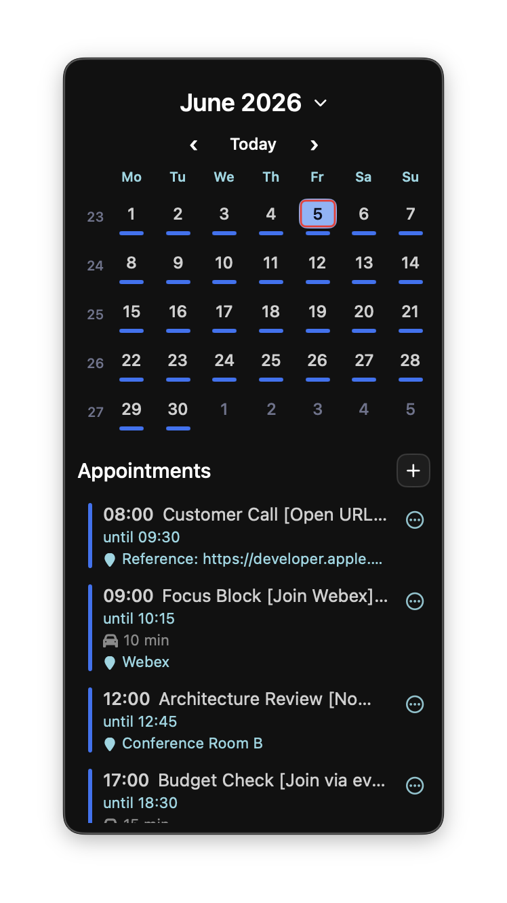
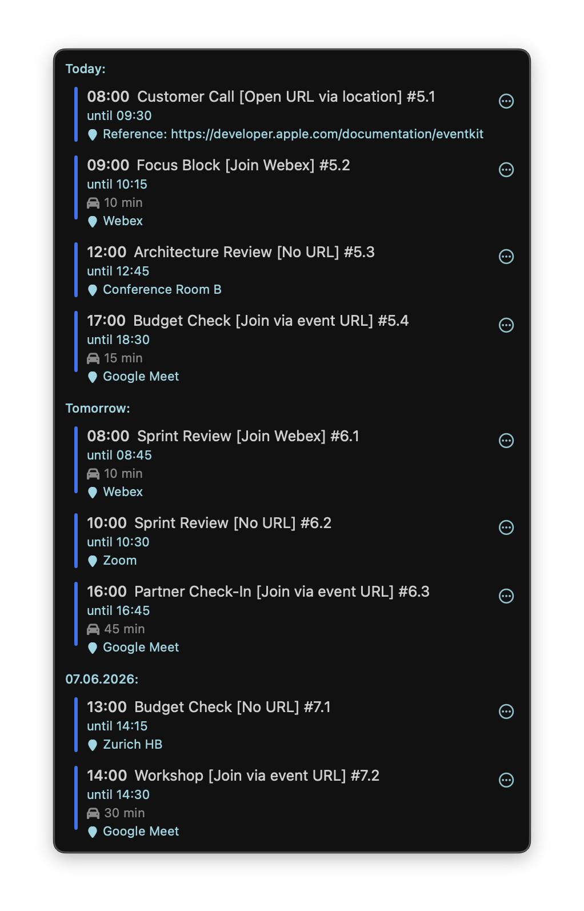
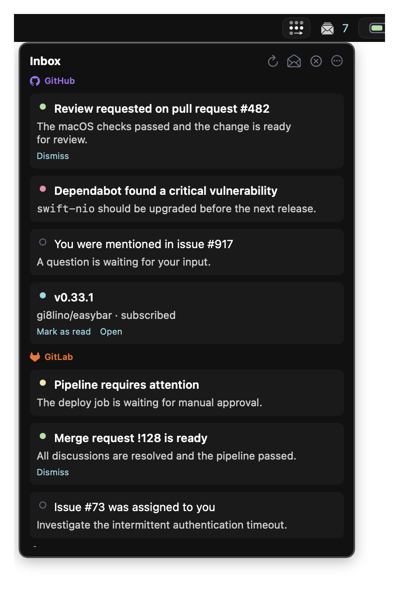
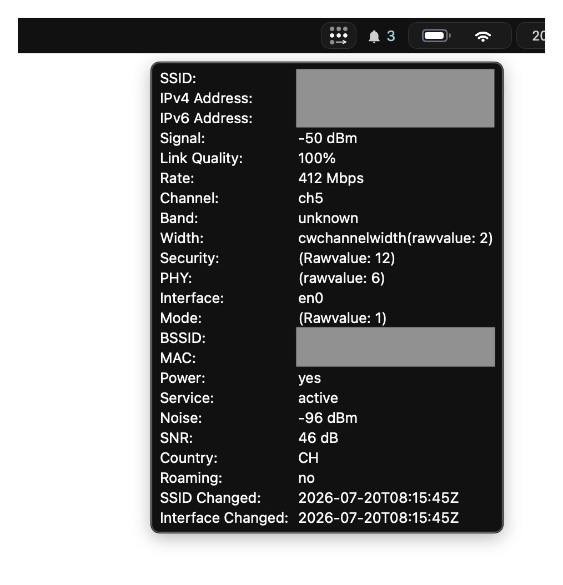

# EasyBar

EasyBar is the customizable full-width macOS top-bar frontend. It combines native SwiftUI built-ins
with the shared EasyBarKit Lua runtime and package system.

Use EasyBar when you want:

- one managed full-width bar surface;
- left, center, and right layout regions;
- native built-ins such as Spaces, battery, Wi-Fi, calendar, volume, CPU, and Inbox;
- native groups, themes, and bar-level appearance control;
- the Calendar and Network helper agents for permission-sensitive data;
- Lua widgets and Widget Store packages beside the native built-ins.

## See EasyBar in action

<div class="easybar-showcase" markdown>

<figure markdown>
[{ .screenshot-compact .screenshot-month }](../../assets/month.png)
<figcaption>Calendar month view with event indicators</figcaption>
</figure>

<figure markdown>
[{ .screenshot-compact .screenshot-upcoming }](../../assets/upcoming.png)
<figcaption>A compact agenda for upcoming events</figcaption>
</figure>

<figure markdown>
[{ .screenshot-compact .screenshot-inbox }](../../assets/inbox.png)
<figcaption>One actionable inbox for multiple sources</figcaption>
</figure>

<figure markdown>
[{ .screenshot-compact .screenshot-wifi }](../../assets/wifi.png)
<figcaption>Native network details at a glance</figcaption>
</figure>

</div>

## Default paths

```text
config       ~/.config/easybar/config.toml
widgets      ~/.config/easybar/widgets
packages     ~/.local/share/easybar/packages
editor stub  ~/.local/share/easybar/easybar_api.lua
runtime      ~/.local/state/easybar/runtime
logs         ~/.local/state/easybar/
CLI          easybar
```

## Start here

1. [Quick Start](quick-start.md)
2. [Installation](installation.md)
3. [Configuration](configuration/index.md)
4. [Choose Built-ins, Store, Or Lua](choosing-widgets.md)
5. [CLI Reference](../../cli/easybar/index.md)
6. [Troubleshooting](runtime/troubleshooting.md)

For the native status-area alternative, see [EasyBar Native](../easybar-native/index.md).

