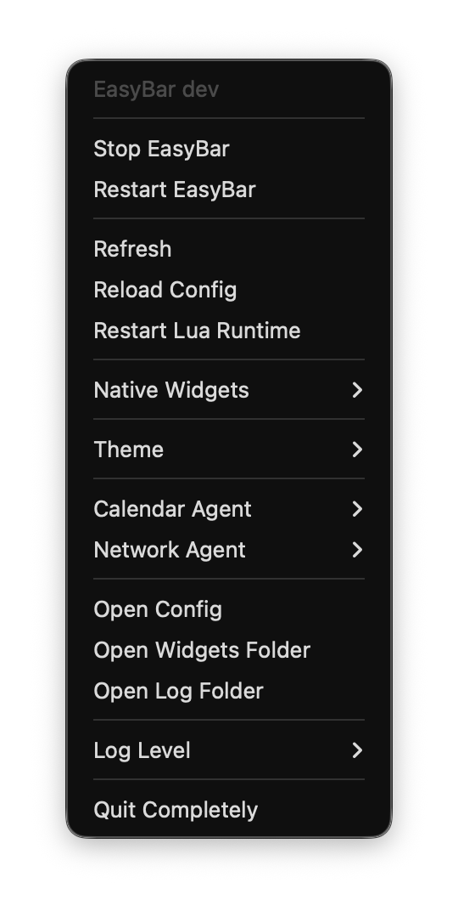

# Runtime Control

Refresh, config reload, Lua restart, and agent restart solve different problems. This page is the behavioral guide; [CLI Reference](../../../cli/easybar/index.md) lists every command and option.

## Menu bar controller

EasyBar shows a persistent controller icon in the macOS menu bar by default. It remains available when the bar itself is stopped, so it can start the bar again without a terminal.

The controller and an empty-area right-click on the bar share the common runtime, native-widget, theme, and file actions. The controller additionally owns application lifecycle, helper-agent, and quit actions.

[{ .screenshot-compact .screenshot-topbar }](../../../assets/topbar_app.png)

Disable the controller icon with:

```toml
[app]
show_menu_bar_icon = false
```

## Choose the right action

| Action           | Command                                        | What changes                                                                                   |
| ---------------- | ---------------------------------------------- | ---------------------------------------------------------------------------------------------- |
| Refresh          | `easybar refresh`                              | Pulls fresh state and emits `easybar.events.forced`; keeps the current config and Lua process. |
| Reload config    | `easybar config reload`                        | Rereads `config.toml` and rebuilds runtime state from the new configuration.                   |
| Restart Lua      | `easybar runtime restart`                      | Starts a fresh Lua process and reloads widgets without rereading config.                       |
| Restart an agent | `easybar agent restart calendar\|network\|all` | Restarts the selected permission-sensitive helper process.                                     |

Use **Refresh** when configuration is already correct but displayed data is stale. Use **Reload config** after editing `config.toml`. Use **Restart Lua** for a clean widget-runtime reset. Restart an agent after permission changes or when its socket-backed data is unhealthy.

## Scripting events

Local automation can tell EasyBar that external workspace state changed:

```bash
easybar event emit workspace_change
easybar event emit focus_change
easybar event emit space_mode_change
```

These commands route through EasyBar's normal event system so subscribed Lua widgets react through the same public event tokens used at runtime. They are hints from automation, not replacements for the native AeroSpace subscription.

## Related pages

- [CLI Reference](../../../cli/easybar/index.md)
- [Troubleshooting](troubleshooting.md)
- [Agent Diagnostics](agent-diagnostics.md)
- [Control Socket](../../../internals/architecture/control-socket.md)

